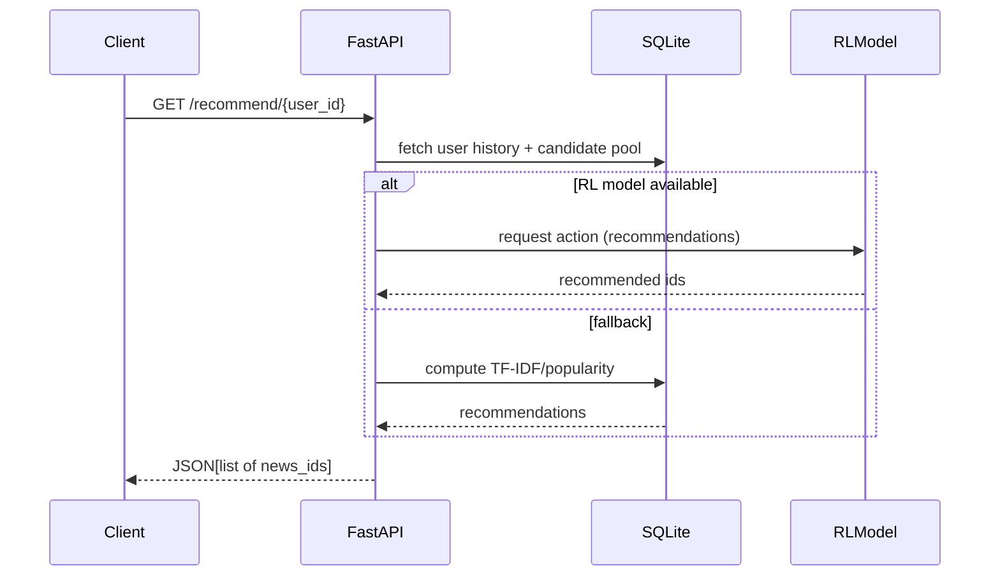

# Causal-Informed Reinforcement Learning Recommender (MIND Dataset)

This repository contains a production-oriented backend for a causal-informed reinforcement learning recommender system built around the MIND news recommendation dataset. It provides reproducible preprocessing, embedding generation, causal estimation, a Gym-compatible RL environment, PPO training, evaluation utilities, and a FastAPI server to serve recommendations.

This README documents every major component, setup steps, pipeline orchestration, files and folders, troubleshooting notes, and a concise rebuild checklist you can copy into a fresh workspace.

--

Contents (quick links)
- Overview
- Quickstart (clone → build → test)
- Project layout and file descriptions
- Pipelines and commands
- Module-level documentation
- Tests
- Tips, troubleshooting & performance notes
- Rebuild checklist for a fresh workspace

--

Overview
--------

This project demonstrates a complete backend for an experimental recommender that combines:

- Deterministic preprocessing for the MIND dataset (news parsing, impression parsing, cleaning)
- Dense and sparse item representations (sentence-transformers + TF-IDF)
- A causal analysis component (graph + estimators) to inform treatment effects or debiasing
- A Gym-compatible recommender environment and PPO-based RL agent using Stable-Baselines3
- Lightweight baseline recommenders (popularity, TF-IDF similarity, random)
- A FastAPI server exposing recommendation and metadata endpoints

Design goals
- Reproducibility: artifacts saved under `data/processed/`, `models/`, `database/` for reproducible runs
- Defensive imports: heavy ML libs are lazy-loaded so unit tests and lightweight tools run without full installs
- Regenerable artifacts: large intermediate files (embeddings, processed CSVs) are regenerable by the pipeline
- Safe-by-default: scripts avoid destructive changes and provide safe fallbacks when artifacts are missing

Quickstart — Minimal (recommended)
----------------------------------

These commands assume you will rebuild in a fresh environment (Python 3.10 recommended). Use the included `requirements.txt` to create a minimal virtualenv.

1) Clone and create virtualenv

```bash
git clone <your-repo-url>
cd causal_rl_recommender
python3.10 -m venv .venv
source .venv/bin/activate
pip install --upgrade pip
pip install -r requirements.txt
```

2) Preprocess the MIND raw files (this writes to `data/processed/`)

```bash
# Ensure the MIND raw files are at data/raw/MIND/
./.venv/bin/python -m src.preprocessing.auto_clean
```

3) Build embeddings (sentence-transformers) and TF-IDF matrix

```bash
./.venv/bin/python -m src.preprocessing.embedder
```

4) Populate the SQLite DB (writes to `database/recommender.db`)

```bash
./.venv/bin/python -m src.preprocessing.populate_database
```

5) (Optional) Run evaluation and/or train RL agent

```bash
# Quick evaluation (no RL training)
./.venv/bin/python -m src.utils.evaluate

# Train PPO (resource heavy)
./.venv/bin/python -m src.rl.train_ppo --config configs/ppo_config.yaml
```

6) Launch the API server (provides `/recommend/{user_id}` and other endpoints)

```bash
uvicorn api.server:app --reload --host 0.0.0.0 --port 8000
```

Quick commands (one-line)
-------------------------

If you want a compact set of commands that does the minimal pipeline in one go (useful for quick starts), run:

```bash
git clone <your-repo-url>
cd causal_rl_recommender
python3.10 -m venv .venv && source .venv/bin/activate
pip install -r requirements.txt
./.venv/bin/python -m src.preprocessing.auto_clean
./.venv/bin/python -m src.preprocessing.embedder
./.venv/bin/python -m src.preprocessing.populate_database
uvicorn api.server:app --reload --host 0.0.0.0 --port 8000
```

Convenience targets
-------------------

This repository also includes a `Makefile` and `REBUILD.md` with convenience targets and Codespaces-specific rebuild instructions. Use the `Makefile` targets for `preprocess`, `embed`, `populate`, `train`, and `serve` to avoid typing long commands. See `REBUILD.md` for a tested Codespaces rebuild checklist.

Project layout (high level)
---------------------------

Top-level:

- `api/` — FastAPI server entrypoint and app definitions (`api/server.py`)
- `data/raw/MIND/` — Place the original MIND files (e.g. `news.tsv`, `behaviors.tsv`) here
- `data/processed/` — Preprocessed CSVs created by the preprocessing modules
- `database/` — SQLite database file `recommender.db` (created by populate script)
- `models/` — Saved model artifacts: `news_embeddings.npy`, `news_id2idx.json`, `tfidf_matrix.npy`, plus `rl/` for trained RL models
- `src/` — Main source package (preprocessing, causal, rl, utils)
- `configs/` — Config files (e.g., `ppo_config.yaml`)
- `tests/` — Pytest unit tests and integration checks
- `run_all.sh` — Orchestration script that runs the pipeline end-to-end (use with caution for heavy steps)

Detailed module documentation
-----------------------------

`src.preprocessing`:
- `mind_preprocess.py` — Parsing utilities for the MIND files. Outputs cleaned `news_processed.csv` and `interactions_processed.csv` under `data/processed/`.
- `embedder.py` — Builds TF-IDF sparse matrix and dense sentence-transformer embeddings. Saves `models/news_embeddings.npy` and `models/news_id2idx.json`. Uses lazy imports for `sentence_transformers`.
- `populate_database.py` — Creates `database/recommender.db` and populates `news`, `users`, `interactions` tables. Serializes embeddings into the DB. Note: for large datasets this can be memory/time consuming; sample-mode or chunked commits are advised for constrained environments.
- `auto_clean.py` — Convenience wrapper to run preprocessing end-to-end and to avoid reprocessing when artifacts exist.

`src.causal`:
- `causal_graph.py` — Builds a simple causal graph skeleton (networkx) showing treatment/outcome/covariates.
- `counterfactual_estimator.py` — Wrappers for DoWhy/EconML estimators to compute ATE/ITE and store results under `results/`.

`src.rl`:
- `reco_env.py` — Gymnasium-compatible environment that exposes the recommendation problem as a sequential decision process. Provides safe fallbacks if DB or embeddings are missing.
- `train_ppo.py` — Wrapper to train a PPO agent using Stable-Baselines3. Config-driven via `configs/ppo_config.yaml`.

`src.utils`:
- `baseline_recommenders.py` — Simple recommenders: popularity, TF-IDF cosine similarity, random.
- `evaluate.py` — Lightweight evaluation metrics for CTR, coverage, diversity, novelty; written with lazy imports to avoid heavy ML dependencies during quick checks.

`api/server.py`:
- Exposes endpoints:
	- `GET /recommend/{user_id}` — returns a list of recommended `news_id` for that user (RL model if available, otherwise TF-IDF/popularity fallback)
	- `GET /article/{id}` — metadata for an article
	- `GET /user/{id}/history` — user impression/click history
	- `POST /interact` — observe a user interaction

Testing
-------

Run unit tests via `pytest` (inside your virtualenv):

```bash
./.venv/bin/python -m pytest -q
```

The test suite uses fast, dependency-light fixtures so tests can run without GPU/Torch installed. Heavy libraries are only required for RL training and the embedding step.

Troubleshooting & tips
----------------------

- Disk space: RL and GPU-enabled `torch` can occupy several GBs. Keep a careful eye on free space before training. Regenerable artifacts include the TF-IDF and embeddings (`models/*.npy`) and `data/processed/*` — you can safely delete them and re-run the embedder/preprocessing.
- Long-running tasks: `train_ppo` and full `populate_database` may run long and be killed by Codespaces limits. For constrained environments, populate the DB in chunks (modify `populate_database.py`) or create a small sample DB (the project includes logic to support sample runs).
- Import errors: If you see missing package errors, install them into your venv. Use `pip install -r requirements.txt` to get a working minimal environment. Heavy packages (torch, stable-baselines3) are optional for lightweight operations.

Rebuild checklist for a fresh workspace (copy/paste)
---------------------------------------------------

1) Create venv and install minimal requirements

```bash
python3.10 -m venv .venv
source .venv/bin/activate
pip install --upgrade pip
pip install -r requirements.txt
```

2) Place the MIND raw files under `data/raw/MIND/`:

- `news.tsv`, `behaviors.tsv` (original dataset files)

3) Run preprocessing and embedder

```bash
./.venv/bin/python -m src.preprocessing.auto_clean
./.venv/bin/python -m src.preprocessing.embedder
```

4) Populate the DB (or create a sample DB if space/time limited)

```bash
./.venv/bin/python -m src.preprocessing.populate_database
```

5) Optional: train RL

```bash
./.venv/bin/python -m src.rl.train_ppo --config configs/ppo_config.yaml
```

6) Start API

```bash
uvicorn api.server:app --reload --host 0.0.0.0 --port 8000
```

Security & data notes
---------------------

- This repo and the MIND dataset may contain user-behavior logs. Treat processed data with care: avoid uploading it to public services unless you are allowed to do so.
- When distributing artifacts, do not include large GPU binaries from `.venv` — instead publish a `requirements.txt` and a short note documenting optional heavy dependencies.

Maintenance & extension ideas
-----------------------------

- Add streaming or chunked DB population to make `populate_database` safe for constrained environments.
- Add Docker/Devcontainer automation to lock tooling versions and avoid environment drift.
- Add automated evaluation scripts and CI that run only lightweight tests (skip heavy steps) to keep PR checks fast.

Contact & next steps
--------------------

If you'd like, I can:

- Add a short `REBUILD.md` with exact commands for Codespaces.
- Add a `Makefile` with targets for `preprocess`, `embed`, `populate`, `train`, and `serve`.
- Prepare a minimal Dockerfile for CI-friendly runs.

--

This README was generated to be thorough and actionable. If you want a shorter marketing-style README (one-pager) or a developer-focused quick reference, tell me which flavor and I'll produce it.

Visuals
-------

I added a few lightweight visuals to help you understand the architecture and request flow. GitHub supports Mermaid diagrams in markdown (enabled in many renderers); if your renderer doesn't, the ASCII diagram below provides the same information.

1) Architecture flow (Mermaid)

```mermaid
flowchart LR
	A[Raw MIND files] --> B[Preprocessing]
	B --> C[Processed CSVs]
	C --> D[Embedder (TF-IDF + SBERT)]
	D --> E[models/ (embeddings, tfidf)]
	E --> F[Populate DB (SQLite)]
	F --> G[RL Env / Train PPO]
	G --> H[Trained RL model (models/rl/)]
	E --> I[Baseline recommenders (tfidf / popularity)]
	H --> J[API Server (FastAPI)]
	I --> J
	F --> J
	J --> K[Clients / Frontend]
```

2) Request sequence (Mermaid sequence)



3) ASCII architecture (fallback for non-mermaid viewers)

```
  [data/raw/MIND]      Preprocessing      [data/processed]
		| ------------------------> | ----------------------> |
		|                            |                        |
		V                            V                        V
   embedder (TF-IDF + SBERT) ---> models/ (embeddings, tfidf) ---> populate_database ---> database/recommender.db
															  \                                    /
															   \---> src/rl/reco_env + train_ppo ---> models/rl/
																			|
																			V
																	   api.server (FastAPI)
																			|
																			V
																	  Client / Frontend
```

4) Small diagram: data vs model artifacts

```
data/processed/           models/
-----------------         ------------------
- news_processed.csv      - news_embeddings.npy
- interactions_*.csv      - news_id2idx.json
						 - tfidf_matrix.npy
						 - rl/ppo_model.zip (when trained)
```

Notes about visuals
- Mermaid diagrams render on GitHub and many markdown viewers; if your viewer doesn't display them, rely on the ASCII diagrams above.
- If you'd like PNG/SVG exports of these diagrams committed into the repo, I can generate them and add them under `docs/` (they will increase repo size). Tell me which diagrams to export.


# causal_rl_recommender
Mini ect sem 5th
